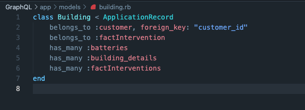
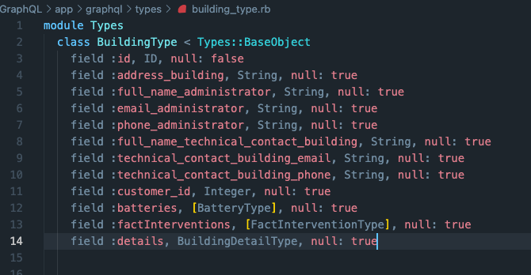
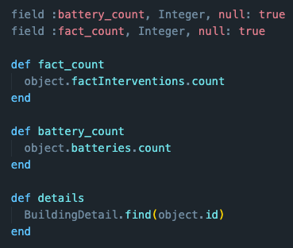
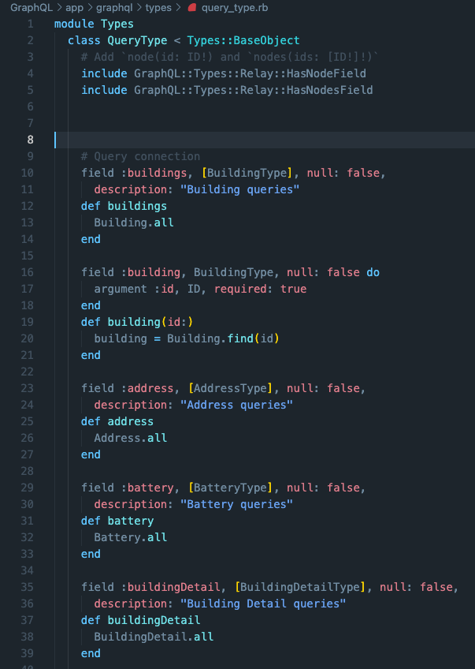
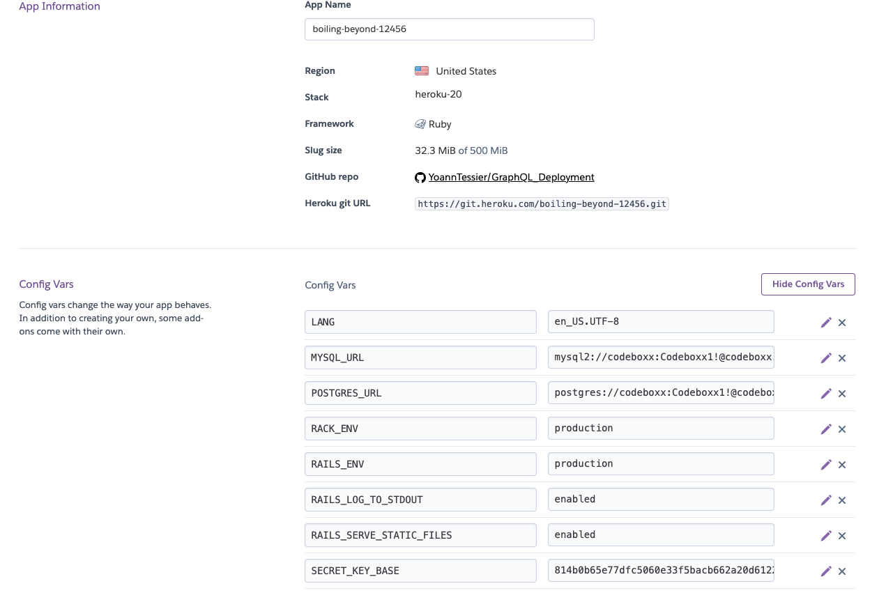

</br>

# Rocket Elevators GraphQL API #


### Important Information ###

Heroku App URL : https://boiling-beyond-12456.herokuapp.com/

<details>
<summary><i><b>QUERIES</b></i></summary>

```
query question1{
 factIntervention(id:4){
    building{
    addressBuilding
  }
  startOfIntervention
  endOfIntervention
 }
}
```

```
query question2{
  building(id:8){
    addressBuilding
    interventions{
      id
      startOfIntervention
      endOfIntervention
      result
    }
    customer{
      id
      companyName
      fullNameCompanyContact
      companyContactPhone
      companyContactEmail
    }
  }
```
```
query question3{
    employee(id:5){
    firstName
    lastName
    interventionsCount
    interventions{
      id
      building{
        addressBuilding
        details{
          informationKey
        }
      }
    }
  }
}
```

</details>

--------------------------------------------------------------------------------------------------------------------

### This week we developped a *GraphQL API* Using *Ruby on Rails* that we deployed on *Heroku*. ###

We started by generating **Models** in order to link our different tables together. Here is an example:



</br>

We then generated **GraphQL Types** using the **Models** in order to have all the **Fields** populated. We also added other **Types** as **Fields** to allow us to query different tables through another:



We also added **Methods** to the *Types*:



</br>

Finally we had to define our different **Query Types**:



</br>
</br>


Then came the time for the **Deployment** which we chose to do on **Heroku**

Here are the settings we have:



